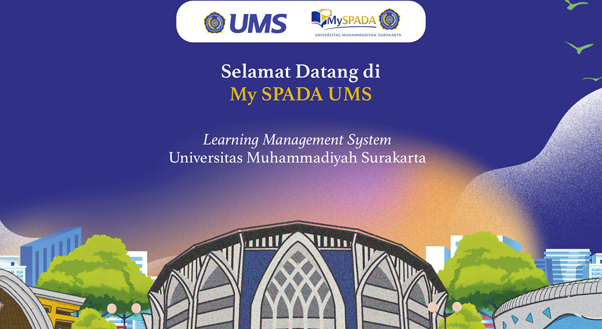

# Outcome Based Education - Converter

**[Landing Page for SEB](https://ums.id/obefpsi)** - Interactive Website for OBE Conversion

## To Do Lists
- [x] **Create a Website:** Initialize the website from Prompt of Conversion ANUMS to SPADA's Score
- [x] **Create an Automatic:** Based on the Schedule that is available
- [x] Clientside - Means no data were sent to Server at all
- [x] Redesign the Website
- [x] Automatically the System

⚡ Click to see the IDEAS

## Backlog / Ideas
- [x] *Optional:* Add dark mode toggle
- [X] Add for every permutable NIM (Student Number) in UMS
- [ ] 

---
> **Note:** Remember to check the system once every while.
>

## Tech Stack

  

Distributed under the MIT License.  
See [LICENSE](./LICENSE) for more information.